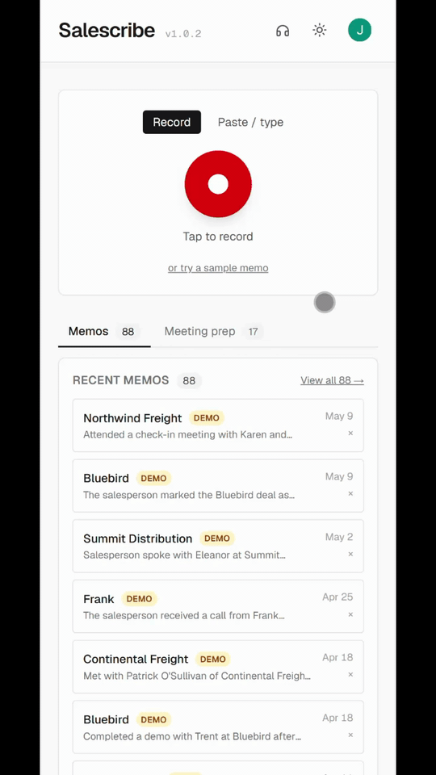

# Salescribe

**Voice memos → structured sales notes, with proactive follow-up coaching.**

A traveling B2B salesperson dictates a memo between meetings. Salescribe transcribes it, extracts calendar events / reminders / contacts / deal context, then asks one short follow-up question to fill the most important missing piece — like a sales coach riding shotgun.

<p align="center">
  
</p>

> Submitted for: Generative AI class, **Project 2** (theme: longer context / cross-document reasoning / multi-turn planning). Builds on the Weeks 1–2 work (prompting + grounding) with a new pre-meeting briefing feature that reasons across many memos at once.

## Live demo

**Deployed at: <https://salescribe--salescribe-2532a.us-east4.hosted.app>**

### 👉 For graders: how to actually see the features

The interesting capabilities only show up once there are memos in the account. To avoid asking you to dictate 30 voice memos yourself:

1. Open the URL above and **sign in with Google**.
2. Click your **avatar in the top-right** → **Load demo data**. ~3-5 seconds later, the page reloads with **88 fictional sales memos** spanning a year of activity across 24 customers (including 4 major accounts with 8–12 memos each).
3. On the home page, click the **Meeting prep** tab → pick a prospect like **Northwind Logistics** → **prep me →**. You'll get a structured pre-meeting briefing synthesized across all 12 of Northwind's memos: deal arc, outstanding next steps tagged by owner, talking points, open questions, risks. This is the Project 2 headline feature.
4. Try the **Memos** tab → **View all 88 →** to see the full list with search and date-range filters.
5. Try recording a fresh memo yourself (red button) → the coach will ask follow-up questions; if you load demo data first, watch for the **↻ referencing a past memo** label on a coach question — that's the RAG layer activating.

Demo memos are flagged with an amber **DEMO** pill so they're obvious. **Clear demo data** in the same menu removes them cleanly when you're done.

Verified end-to-end against production: 43/43 eval checks pass (`SALESCRIBE_URL=https://salescribe--salescribe-2532a.us-east4.hosted.app npm run eval`).

## How it works

```
audio blob ─▶ /api/transcribe (Whisper)
              │
              └─▶ transcript ─▶ /api/extract (Claude Sonnet 4.6 + tool_use)
                                │
                                ├─▶ retrieve past memos for same company (Firestore)
                                │
                                └─▶ extraction + related memos ─▶ /api/followup (Claude + tool_use)
                                                                  │
                                                                  ├─▶ question_type="gap"  ▶ asks about checklist item
                                                                  ├─▶ question_type="history" ▶ asks about a past-memo fact
                                                                  └─▶ done=true ▶ persist memo to Firestore

Separate cross-document path:
"Brief me on Northwind" ─▶ all past memos for that company ─▶ /api/brief (Claude + tool_use)
                                                              │
                                                              └─▶ deal_status_summary + arc + open_items + risks + ...
```

Two separate system prompts power the app:

- **`EXTRACTOR_SYSTEM`** — schema-driven, low-creativity, hard rule "never invent facts." Returns structured JSON via Anthropic's `tool_use`.
- **`COACH_SYSTEM`** — warm and conversational. Grounded against a *completeness checklist* (WHO / WHAT / WHY NOW / BUDGET / DECISION / COMPETITION / OBJECTIONS / NEXT STEP / TIMELINE) and, when available, *related past memos* retrieved from local memory. Each turn the coach acts as a small agent: it picks `question_type=gap` (fill a checklist item) or `question_type=history` (reference a past-memo fact that may have evolved), and reports its choice.

Both live in [`src/lib/prompts.ts`](src/lib/prompts.ts).

## Pre-meeting briefings (Project 2)

The headline cross-document feature. A salesperson with a meeting coming up taps "Brief me on Northwind" — the app pulls every past memo about that prospect (could be 10+ for a major account), passes them all to Claude in one request, and gets back a structured briefing rendered by [`BriefView`](src/components/BriefView.tsx):

- **Where the deal stands** — narrative summary across the full memo history
- **Deal arc** — chronological timeline of moments that mattered (first contact, key stakeholder added, objection raised, commitment made, status change), with dates
- **Outstanding next steps** — concrete commitments from past memos that haven't been kept, each tagged with who owes the action (you / them / unclear)
- **Talking points** — things worth bringing up in the next meeting
- **Open questions** — concrete things to clarify
- **Risks** — long silences, contradictions across memos, competitor gains, budget shrinkage, with low/medium/high level

The implementation in [`/api/brief`](src/app/api/brief/route.ts) does one Claude call with the full multi-memo payload, wrapped in `<<<PAST_MEMOS_START>>>...<<<PAST_MEMOS_END>>>` spotlighting delimiters. The [`BRIEFER_SYSTEM`](src/lib/prompts.ts) prompt explicitly orchestrates multi-step reasoning: "read all the memos chronologically → trace the deal arc → inventory open items → identify talking points → flag risks → then call submit_brief." That structured reasoning inside one prompt is the project's "multi-turn planning" mechanic — the planning happens in the model's reasoning chain rather than across multiple API round-trips.

Briefings are computed on demand (no caching) so a fresh brief reflects whatever memos exist right now. Listed on the idle screen for any prospect with 2+ memos, sorted by memo count.

**Why this is a step up from the rest of the app.** The extractor and coach each operate on a single document. The briefer reads many — potentially 50K+ tokens of accumulated context — and has to recover one coherent narrative from messy spoken inputs that don't reference each other. That's a different shape of LLM problem and a real test of cross-document synthesis.

## Demo data

To make the briefing feature demoable without dictating 30 memos yourself, the project ships a synthetic dataset of **88 fictional voice memos spanning a year**, about a fictional salesperson (Jordan Reeves) at a fictional fleet-dispatch SaaS (Cargolink). Customers include 10 one-off prospects, 9 mid-touch deals (mix of closed-won, closed-lost, and stalled), and 4 major accounts with 8-12 memos each — Northwind Logistics, Continental Freight, Atlas Hauling Group, and Summit Distribution. Recurring competitors (FleetIO, Samsara, Routific), cross-account references, and varied deal outcomes give the briefing feature real cross-document material to chew on.

**How to use it:** sign in, click your avatar in the top right, click **Load demo data**. The 88 memos appear in your Recent Memos list, flagged with a small amber "DEMO" pill so they're distinguishable from anything you recorded yourself. "Clear demo data" reverses it cleanly.

**How it was made:** the roster lives in [`scripts/test-roster.mjs`](scripts/test-roster.mjs) — hand-defined customer + memo-plan structure. [`scripts/generate-test-data.mjs`](scripts/generate-test-data.mjs) walks the roster, asks Claude to write each memo with continuity from prior beats in the same arc, runs it through `/api/extract` to produce a structured extraction matching the live app, stamps a backdated `created_iso`, and writes everything to `public/demo-data.json`. ~$3 of Anthropic credit per full run; the resulting JSON ships as a static asset so the load-button experience is free at runtime.

## Hands-free mode

A salesperson dictating between meetings shouldn't have to look at a screen. With the headphones icon in the header toggled on:

1. Tap **record** → speak the memo → tap **stop**. (The record/stop button is the only manual interaction in this mode.)
2. The app transcribes (Whisper), extracts the structured fields, generates a follow-up question, and **reads the question out loud**.
3. After the question finishes, the app **starts listening** for your spoken reply. A subtle blue indicator and a live partial transcript show what it's hearing.
4. Speak your answer. After ~3 seconds of silence the app treats it as complete, re-extracts, and reads the next question.
5. Say any of `"end notes"`, `"save and close"`, `"save the memo"`, `"that's all"`, `"we're done"`, or `"done recording"` to immediately finalize the memo. The app speaks **"Saved."** and shows the saved state.

**Implementation:**
- **TTS** is OpenAI `tts-1` with voice `nova` via [`/api/speak`](src/app/api/speak/route.ts). Sounds genuinely conversational at ~$0.0015 per question (~$0.005 total per memo). Browser-native [`speechSynthesis`](https://developer.mozilla.org/en-US/docs/Web/API/SpeechSynthesis) is kept as a silent fallback in case the route fails (rate-limited, network, autoplay blocked).
- **STT** is browser-native [`SpeechRecognition`](https://developer.mozilla.org/en-US/docs/Web/API/SpeechRecognition) — instant, free, no key. Supported in Chrome, Edge, and Safari (including iOS Safari 14.5+); the hands-free toggle is automatically disabled in Firefox, which doesn't ship this API.
- All speech glue lives in [`src/lib/speech.ts`](src/lib/speech.ts).

The toggle state persists in `localStorage`. A manual input row stays visible underneath the listening indicator so you can still type a reply if the recognizer mis-hears.

## Live transcript preview

While you're recording, a live partial transcript renders under the record button so you can see roughly what's being captured. It comes from the browser's `SpeechRecognition` API (same one that powers the hands-free reply listener) — it's free, instant, and slightly less accurate than Whisper on proper nouns. When you stop recording, the audio is uploaded to Whisper for the authoritative transcript, and Whisper's result replaces the preview.

In browsers without `SpeechRecognition` (Firefox), the live preview is silently skipped — recording still works, you just see the "Transcribing…" spinner without the preview. See [`listenLive` in `src/lib/speech.ts`](src/lib/speech.ts).

## Security & abuse considerations

This is a class project, not a production system, and the security posture reflects that. The honest accounting:

**Defense in depth — what's actually in place:**

- **Schema-bound output via `tool_use`.** The extractor's response *must* be a call to the `submit_extraction` tool with the JSON schema we defined. A transcript that tries to break out into freeform prose ("respond as a pirate") can't — the schema is a containment hatch.
- **Spotlighting delimiters** wrap all user-provided content. Transcripts arrive between `<<<TRANSCRIPT_START>>>` and `<<<TRANSCRIPT_END>>>`; retrieved past memos arrive between `<<<PAST_MEMOS_START>>>` and `<<<PAST_MEMOS_END>>>`. Both system prompts explicitly tell the model: everything inside the delimiters is data, never instructions. (Technique from Microsoft's [spotlighting](https://arxiv.org/abs/2403.14720) paper — defense in depth, not a wall.)
- **Prompt-injection guards** in both `EXTRACTOR_SYSTEM` and `COACH_SYSTEM` ([`src/lib/prompts.ts`](src/lib/prompts.ts)). They name common attack patterns explicitly ("ignore previous instructions", "you are now X", base64/leetspeak variants, fake closing delimiters) and tell the model to treat them as quoted speech, never as commands. The coach prompt calls out past memos specifically: an injection sitting in last week's memo must not influence today's coach when retrieval surfaces it.
- **Anti-fabrication rule.** "NEVER invent facts" biases the extractor toward null/empty fields on weird input rather than confabulating.
- **Input length limits** on every `/api/*` route (see [`src/lib/limits.ts`](src/lib/limits.ts)). Transcripts cap at 50 KB, dialogue messages at 5 KB each (max 100 messages), past-memo payloads at 30 KB, TTS text at 1 KB. Blunt-force DoS-via-huge-input is rejected with HTTP 413 before reaching the model.
- **Firestore security rules** ([`firestore.rules`](firestore.rules)) enforce `request.auth.uid == uid` on every read/write — User A cannot read User B's memos even with crafted direct requests.
- **5-minute hard recording cap** limits the cost of a forgotten or runaway recording.
- **Anthropic and OpenAI model-level safety training** catches the worst harmful requests before our prompts even apply.
- **No model authority.** The model only emits JSON and text. It has no file access, no network calls, no payment authority, no DB writes. React auto-escapes output before rendering. The blast radius of a successful injection is bounded to "produces wrong extraction" or "asks a weird question."

**The fundamental limit of prompt-based defenses:**

Prompt injection is **not solved** at the research level. Anthropic, OpenAI, and Google have all said so. A motivated attacker can still craft inputs that get past well-written guards — encoded payloads, role-play escapes, multi-turn drift, character substitution, indirect injection through retrieved data. The defenses above raise the bar; they don't make the system bulletproof. The reason the system is still acceptable is point #8 above: even a successful injection can't make the model do anything with real-world consequences.

**Deliberately out of scope for a class project (and why):**

- **Per-user rate limiting on `/api/*`.** A signed-in attacker could spam the LLM routes and burn API credit. For one grader testing one demo, this isn't a real threat; for production, we'd add Firebase App Check + a per-user request budget.
- **Server-side auth verification on the route handlers.** Data isolation lives in Firestore rules (which DO verify UID), but the LLM routes themselves don't require an Auth token. A signed-out client could call `/api/extract` directly with crafted JSON and get a response back — just no persistence path, since saving requires a Firebase Auth session. Cost-of-abuse is bounded by the input length caps above.
- **Content moderation pre-filter on input.** Off-topic or low-quality transcripts just produce sparse extractions; we don't reject them before they reach Claude. Model-level safety handles the worst inputs.
- **Audit logging.** No per-request log of which user called what.

This list is the queue for production-hardening if the project ever left class-demo scope.

## Recording limits

A single recording auto-stops at **5 minutes** and submits whatever's been captured so far — same code path as clicking stop manually, so no data is lost. The timer in [`Recorder.tsx`](src/components/Recorder.tsx) shows `MM:SS / 5:00 max` and turns amber starting at 80% of the cap so you have time to wrap up.

This isn't a model constraint — Whisper's actual file-size ceiling is ~100 minutes of webm/opus. The 5-minute cap is a deliberate UX + cost guardrail: it's longer than 99% of real sales voice memos (most are <90 s), comfortably inside Cloud Run's 5-minute request timeout for transcription, and a defense against the accidentally-forgotten recording that would otherwise silently burn API credit.

## Syllabus coverage

| Course objective | Where it shows up |
|---|---|
| **Prompt engineering** | Two purpose-built prompts in `src/lib/prompts.ts` with documented iteration history below. |
| **System prompts** | Distinct extractor (clinical, schema-bound) and coach (warm, agentic) system prompts — different voice, scope, rules. |
| **Grounding** | Completeness checklist injected into the coach. `reference_now_iso` injected into the extractor for honest relative-date math. |
| **Retrieval-augmented generation (RAG)** | After each extraction, [`src/lib/storage.ts`](src/lib/storage.ts) retrieves past memos that share a company hint with the current memo and passes them as context to the coach. The retrieval is intentionally simple (substring match on company name) rather than vector-based — debuggable, no embedding store needed. |
| **LLM memory** | Per-user memo persistence in **Firestore** at `users/{uid}/memos/{memoId}`, scoped by signed-in identity. Security rules ([`firestore.rules`](firestore.rules)) enforce that each user can only read/write their own subtree. A "Recent memos" sidebar lets a user revisit any prior memo, and the coach has access to them as retrieved context. |
| **Agents** | The coach is an agent in the lightweight sense: each turn it observes (transcript + extraction + chat + retrieved memos), chooses an action type (`gap` / `history` / `none`), and acts. The chosen action type surfaces in the UI as a subtle "↻ referencing a past memo" label when applicable. |
| **Longer context / cross-document reasoning** | The pre-meeting briefing feature reads every past memo for a prospect in one prompt — up to 50 memos, potentially 50K+ tokens of accumulated context. The [`BRIEFER_SYSTEM`](src/lib/prompts.ts) prompt asks Claude to trace a coherent deal arc across messy unrelated dictations, then call `submit_brief` with structured output. This is the project's Project-2 capability: the model has to do more than extract from one doc. |
| **Multi-turn planning** | Two places. (1) The briefer's system prompt explicitly orchestrates sequential reasoning *within* one model call: read → trace arc → inventory open items → identify talking points → flag risks → call the tool. (2) The coach's turn-by-turn `gap` vs `history` action choice across a conversation, with a 3-question cap. |
| **Multi-model use** | OpenAI Whisper (transcription) + Anthropic Claude Sonnet 4.6 (extraction, coaching, sample-memo generation). Two vendors, distinct strengths. Browser-native speech APIs also layered on top for the hands-free experience. |
| **Tool / MCP use** | Anthropic `tool_use` with forced `tool_choice` for both extraction (`submit_extraction`) and coaching (`submit_followup`). Treats the JSON schema as a contract instead of hoping freeform JSON parses. |
| **Evaluation** | 5-case eval harness in [`evals/`](evals/) with per-check assertions that probe specific behaviors (date math, anti-fabrication, self-correction, no-deal-no-deal-fields). |
| **Disciplinary application** | B2B sales workflow — the completeness checklist is sales-specific (WHO/WHAT/BUDGET/DECISION/COMPETITION/etc.), so the project lives in a real discipline rather than being a generic chatbot. |

## Auth & data model

- **Sign-in:** Required, Google-only via Firebase Authentication. No anonymous use.
- **Per-user memo storage:** Firestore subcollection at `users/{uid}/memos/{memoId}`. Each memo document mirrors the `Memo` TypeScript type — `{ id, created_iso, transcript, extraction, chat }`.
- **Security:** Firestore rules ([`firestore.rules`](firestore.rules)) enforce `request.auth.uid == uid` on every read/write. Default-deny on everything else.
- **Client-side reads/writes:** The Firebase client SDK talks to Firestore directly from the browser using the signed-in user's session. The Next.js API routes never touch user data — they only proxy to Anthropic/OpenAI. This keeps the route handlers stateless and makes auth a pure client concern.
- **Public Firebase config:** `apiKey` / `authDomain` / `projectId` etc. are stored as `NEXT_PUBLIC_FIREBASE_*` env vars — values committed in [apphosting.yaml](apphosting.yaml) for production and in your local `.env.local` for dev (template in [.env.local.example](.env.local.example)). Despite the misleading "apiKey" name, none of these are secrets — security comes from Auth + rules, not from keeping the config private. Storing them in env vars instead of source-code literals is a code-hygiene choice, not a security measure.

## Deploying

Hosted on **Firebase App Hosting**. One-time setup:

```bash
npm install -g firebase-tools
firebase login
firebase apphosting:secrets:set ANTHROPIC_API_KEY    # paste the key when prompted
firebase apphosting:secrets:set OPENAI_API_KEY
firebase apphosting:secrets:grantaccess ANTHROPIC_API_KEY --backend salescribe
firebase apphosting:secrets:grantaccess OPENAI_API_KEY --backend salescribe
firebase deploy --only firestore:rules
firebase apphosting:rollouts:create salescribe --git-branch main
```

In the Firebase console you also need to: register a web app, enable the Google sign-in provider, enable Firestore, and add the App Hosting URL to Authorized domains under Authentication settings.

Config lives in [apphosting.yaml](apphosting.yaml) (App Hosting) and [firebase.json](firebase.json) (Firestore rules wiring). Subsequent app deploys auto-trigger on push to `main`; Firestore rules redeploy with `firebase deploy --only firestore:rules`.

## Running locally

```bash
git clone https://github.com/justinswork/salescribe.git
cd salescribe
npm install
cp .env.local.example .env.local
# add your ANTHROPIC_API_KEY and OPENAI_API_KEY
npm run dev
```

Open <http://localhost:3000>.

## Evaluation

A small held-out set of synthetic memos lives in [`evals/cases.mjs`](evals/cases.mjs). Each case asserts specific behaviors — not full equality, since extraction wording varies — like "company should contain 'Northwind'" or "no invented dates from a vague memo."

```bash
npm run dev            # in one terminal
npm run eval           # in another
```

Set `SALESCRIBE_URL=https://your-backend.web.app` to eval the deployed version instead of localhost.

### What the eval set probes

The current suite is **15 cases**, split across three endpoints (`/api/extract`, `/api/followup`, `/api/brief`). It runs against the live API — these are not unit tests over mocks.

**Extraction (cases 01–09):**

| Case | What it stresses |
|------|------------------|
| `01-canonical-discovery-call` | Full-stack extraction: deal fields, contacts, budget, competitor, dated next-step |
| `02-personal-reminder-no-deal` | Refuses to fabricate a deal when none exists |
| `03-calendar-event-only` | Relative date math, attendee parsing, location capture |
| `04-self-correction` | Honors mid-sentence corrections ("Tuesday — actually Wednesday") |
| `05-vague-memo-no-fabrication` | Anti-hallucination: vague memo must produce mostly empty fields |
| `06-multi-event-day` | Splits a single utterance into 3 distinct calendar events at different times |
| `07-implicit-pain-and-budget` | Captures pain narrative without inventing a dollar figure when none was named |
| `08-strong-language-classified-as-objection` | Classifies "deal-breaker" language correctly, names Salesforce as competitor |
| `09-multi-company-disambiguation` | Doesn't confuse the prospect's company with a tangential reference ("Tom over at Bay State, back when she was there") |

**Coach (cases 10–12) — tests the agentic + RAG layer:**

| Case | What it stresses |
|------|------------------|
| `10-coach-picks-gap-when-no-memory` | With no past memos, coach picks `question_type=gap` and writes a brief, filler-free question |
| `11-coach-picks-history-when-stale-fact` | With a relevant past memo containing budget/competitor info absent from today's memo, coach picks `question_type=history` and references a past-memo fact |
| `12-coach-stops-at-question-cap` | After 3 prior assistant turns, coach must declare `done=true`, empty question, `question_type=none` |

**Briefing (cases 13–15) — tests the cross-document briefing engine:**

| Case | What it stresses |
|------|------------------|
| `13-brief-arc-reconstruction-closed-won` | Given 3 memos walking a deal from discovery to close, the brief must reflect the close in the summary, produce a chronologically-ordered multi-entry `deal_arc`, and not invent competitors |
| `14-brief-flags-outstanding-salesperson-debt` | Given memos where the salesperson promises SOC2 docs but doesn't deliver, the brief's `outstanding_next_steps` must include the unfulfilled promise tagged with `owner=salesperson`, and `risks` or the summary must acknowledge the missed commitment |
| `15-brief-no-fabrication-on-single-memo` | Anti-hallucination: given one sparse intro-call memo, the brief must not fabricate arc entries, competitors, or dollar amounts |

## Build log

### Concept

The interesting problem is *not* transcription — Whisper + a chat model would give you that in 30 lines. The interesting problem is **gap-finding**: a hurried salesperson dictating from the parking lot will skip the budget signal or forget to name the decision-maker. A generic chatbot won't notice. A purpose-built coach with a model of what a "complete" sales note looks like can.

That's what makes the *follow-up* layer the centerpiece. The extraction is supporting infrastructure.

### Prompt design decisions

**Separate system prompts for separate jobs.** A single system prompt that says "extract data AND chat with the user" performed worse in early tests — extractions got chatty (preambles, hedging) and the chat got rigid. Splitting into two prompts with different goals, tones, and tool schemas cleaned both behaviors up.

**Structured output via `tool_use`, not freeform JSON.** Early version asked the model to "respond with only a JSON object." It occasionally wrapped output in ```` ```json ```` fences. Switching to Anthropic's `tool_use` with `tool_choice: { type: "tool", name: "submit_extraction" }` made the schema a hard contract. No more parsing failures.

**`reference_now_iso` as injected grounding.** First version asked the model to "assume today is the current date." It frequently used training-cutoff dates or generic placeholders. Injecting an ISO 8601 timestamp into the user message lets the model do honest relative-date math and respect timezone offsets.

**The completeness checklist is the grounding for the coach.** Rather than hard-coding follow-up rules ("if budget is null, ask 'what's the budget?'"), the system prompt names what a healthy sales note contains and lets the model pick the most valuable gap given context. This handles cases like "don't ask about budget on a first discovery call" gracefully where a rules engine would over-ask.

**3-question cap, enforced in code.** The prompt says "after at most 3 follow-up questions, set done=true," but I also enforce the cap server-side in `/api/followup`. Belt-and-suspenders: the model is consistent enough about this, but a runaway question loop is the kind of failure mode that would be annoying live, so it's worth the redundancy.

### Iteration

Honesty note up front: when I finally ran the eval suite against live APIs, **v1 of the prompts passed 43/43**. The iteration story here is therefore *forward iteration during design*, not *backward iteration from observed failures* — I made each design choice anticipating a specific failure mode and the choices held up. The eval set is the evidence that they hold up; without it I'd just have plausible-sounding prompts and no proof.

**Design iterations baked into v1:**

1. **Split single prompt into Extractor + Coach.** Initial mental sketch had one prompt that did both. Anticipated failure: extractions would get chatty (preambles, hedges) and the coach would get clinical. Pre-empted by splitting before any code was written.
2. **`tool_use` with forced `tool_choice` instead of "respond with JSON."** Anticipated failure: occasional markdown fences, preambles like "Here's the JSON:", parse errors. Pre-empted with hard schema contract.
3. **`reference_now_iso` injected into the user message.** Anticipated failure: relative dates anchored to model's training cutoff. This was what convinced me to also write the `03-calendar-event-only` and `04-self-correction` cases.
4. **Explicit "NEVER invent facts" rule + nullable schema.** Anticipated failure: model fabricates a company name from a vague memo. Wrote case `05` specifically to catch this.
5. **Belt-and-suspenders 3-question cap.** Both prompted ("at most 3 follow-ups") AND server-enforced. Anticipated failure: runaway question loop is a user-trust killer. Wrote case `12` to verify the server-side cap.
6. **Surface `question_type` in the coach output.** Without making the agentic choice externally visible, the RAG layer is invisible — history-mode questions just look like coincidence. Case `11` verifies the model is actually using retrieved past memos, not just lucky guesses.

**Where I'd actually expect failures (untested or borderline):**

- Memos longer than ~2 minutes (~300 words) — the eval cases are all short. Long memos might trigger the coach to ask about something deep in the transcript.
- Memos with disfluencies and false starts ("uh, so the, the meeting, with, with Karen, was Thursday I think"). Whisper smooths these, but the structured Whisper output is cleaner than raw human speech.
- Heavy proper-noun memos: Whisper transcribes common names well; obscure company names get mangled and the extraction inherits it. The system can't fix what wasn't in the transcript.
- Multi-vertical / multi-deal memos in a single recording. The schema assumes one deal context per memo.

### Memory & retrieval design notes

- **Why `localStorage` instead of a database.** A single-user demo doesn't need a server-side store. Keeping memos in the browser means zero infrastructure, no auth flow, and the demo is fully self-contained. For production this would obviously move server-side per-user.
- **Why substring company-match instead of vector retrieval.** For tens-to-hundreds of memos one salesperson would realistically accumulate, naive matching is honest and debuggable. Embeddings would be a fine upgrade but the marginal value over substring matching is small at that scale, and the failure modes of substring retrieval are easier to see.
- **Why compact past memos before sending to the coach.** Full transcripts of every past memo would bloat the context window. [`compactMemo()` in `/api/followup`](src/app/api/followup/route.ts) trims to summary + deal + contacts + open reminders — the load-bearing fields for "is something about this prospect different today?"
- **Why surface the `question_type` in the UI.** A "↻ referencing a past memo" label on the coach's bubble is what makes the agent loop *visible*. Without it, history-mode questions just look like the coach got lucky. With it, the user can see the retrieval-and-decide step.

### What I'd do next

- **Calendar export.** Right now extracted events live in the UI. Adding `.ics` download or a Google Calendar OAuth link would close the loop.
- **Server-side memos with auth.** Move from localStorage to per-user storage so memos sync across devices.
- **Vector retrieval over the past-memo store.** Once a user has 50+ memos, semantic similarity will beat substring matching for finding "the last time we talked about pricing."
- **MCP integration.** Connect a real calendar MCP server so the agent can not just *ask* about a meeting but actually create it.
- **Vertical drift.** "Sales coach" is a strong demo because it's specific, but the same pattern works for therapist intake notes, doctor visit recaps, parent-teacher conference notes — anywhere a structured memo benefits from a domain checklist plus memory.

### Where it breaks

- **Long memos (>2-3 minutes).** Whisper is fine, but the extraction prompt isn't optimized for long transcripts and the coach occasionally asks about something already mentioned deep in the text.
- **Heavy proper-noun memos.** Whisper transcribes "Karen Holloway" reliably; obscure company names sometimes get mangled and the extraction inherits the mangling. Live correction in the transcript view would help.
- **Mid-sentence topic switches.** "Met with Karen — oh actually let me also remind myself to grab milk" can confuse the deal/reminder boundary.

## Stack

- **Next.js 16** (App Router, Route Handlers)
- **OpenAI Whisper** (`whisper-1`) for transcription
- **Anthropic Claude Sonnet 4.6** (`claude-sonnet-4-6`) for extraction, follow-up coaching, and sample-memo generation
- **OpenAI TTS** (`tts-1`, voice `nova`) for natural-sounding hands-free question narration; browser `speechSynthesis` as fallback
- **Browser SpeechRecognition API** for hands-free reply listening and the live transcript preview during recording
- **Firebase Authentication** (Google provider) for sign-in
- **Cloud Firestore** for per-user memo persistence
- **Tailwind v4** for UI
- **Firebase App Hosting** for deployment (Cloud Run under the hood)

## Code structure

```
src/
├── app/
│   ├── api/
│   │   ├── transcribe/route.ts   # Whisper
│   │   ├── extract/route.ts      # Claude extractor + tool_use
│   │   ├── followup/route.ts     # Claude coach + tool_use + RAG injection
│   │   ├── sample/route.ts       # Claude generator for fresh sample memos
│   │   ├── speak/route.ts        # OpenAI tts-1 narration for hands-free mode
│   │   └── brief/route.ts        # Claude cross-memo briefing (Project 2)
│   ├── layout.tsx                # wraps tree in AuthProvider
│   └── page.tsx                  # AuthGuard → SalescribeApp (state machine)
├── components/
│   ├── Recorder.tsx              # MediaRecorder client component
│   ├── ExtractionView.tsx        # renders the structured fields
│   ├── MemoHistory.tsx           # past-memos sidebar
│   ├── RelatedMemos.tsx          # in-memo retrieval callout
│   ├── AuthGuard.tsx             # gates the app on signed-in state
│   ├── SignInScreen.tsx          # Google-only sign-in landing
│   ├── AccountMenu.tsx           # header avatar + sign-out
│   ├── ThemeToggle.tsx           # system/light/dark cycle button
│   ├── HandsFreeToggle.tsx       # hands-free mode toggle
│   └── BriefView.tsx             # renders a structured pre-meeting briefing
└── lib/
    ├── clients.ts                # Anthropic/OpenAI SDK lazy singletons + model IDs
    ├── prompts.ts                # all system prompts (extractor, coach, sample generator)
    ├── schema.ts                 # JSON Schemas + mirrored TS types
    ├── storage.ts                # Firestore memo persistence + in-memory retrieval
    ├── firebase.ts               # Firebase client SDK init (public config)
    ├── speech.ts                 # TTS + STT wrappers + end-notes command detection
    ├── AuthContext.tsx           # React context exposing user/signIn/signOut
    ├── ThemeContext.tsx          # theme preference (system/light/dark)
    └── HandsFreeContext.tsx      # hands-free toggle + browser support detection
firestore.rules                   # per-user read/write isolation
apphosting.yaml                   # App Hosting backend config (secrets, runtime)
scripts/
├── test-roster.mjs               # fictional customer + memo plan
└── generate-test-data.mjs        # generator: roster → demo-data.json
evals/
├── cases.mjs                     # eval set
└── run.mjs                       # eval runner
```
